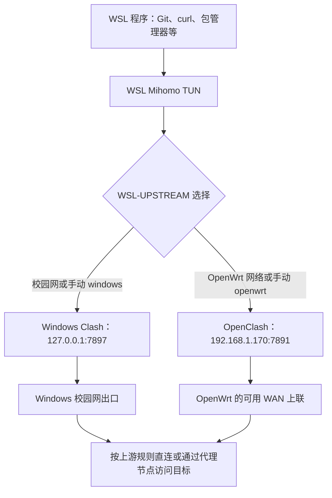

> 我的校园网通过网线和天翼客户端认证，一个账号只允许一台设备；让 OpenWrt 接入会触发多设备限制。因此，校园网使用 Windows Clash，普通 Wi-Fi、手机共享和家用网络使用 OpenWrt。本篇记录已经落地的 WSL 双线路配置，方便以后使用和维护。

本文对应 Windows 11、WSL 2 的 `Ubuntu-26.04`，以及 Hyper-V 中的 `openwrtjump135`。地址和接口是我这台电脑的配置，不能直接当成其他电脑的通用默认值。

## 1、现在的网络结构

### 1.1 WSL TUN 是入口，Windows 和 OpenWrt 是两个出口

WSL 内安装了 Mihomo，由 `wsl-clash.service` 管理。它创建 `wsl-clash` 虚拟网卡，接管 WSL 的 TCP、UDP 流量，再把请求交给选中的 SOCKS5 上游。



图中 Windows 分支描述的是校园网场景。手动选择 `windows` 只保证 WSL 把请求交给 Windows Clash；Windows 最终使用哪条物理线路，仍由它自己的路由和 Clash 配置决定。

**选择 `openwrt` 后，WSL TUN 仍然运行，只是上游从 Windows 换成了 OpenWrt。** 不需要先关闭 TUN，也不需要给每个终端设置 `http_proxy`。

这里的“覆盖 WSL 流量”主要针对已经测试的 TCP、UDP。上游仍按 Clash 规则决定目标是否使用代理节点；不代表所有网站都从代理节点出网。ICMP、独立容器网络和其他 WSL 发行版没有逐一验证。

### 1.2 校园网与普通网络

| 场景 | 网络路径与前提 |
| --- | --- |
| 校园网 | Windows 先完成天翼认证，WSL → Windows Clash → 校园网；已确认校园网网关为 `172.18.15.254` |
| 普通 Wi-Fi、手机共享、家用网络 | 按现有 Hyper-V/OpenWrt 配置提供上联，WSL → OpenClash → OpenWrt 的可用 WAN |
| 未知网络或多条上联同时存在 | 自动模式保守选择 Windows，需要 Windows 自己能够正常联网 |

OpenWrt 的 LAN 地址是 `192.168.1.170`。Hyper-V 的 `lan1` 用于内网连接；已有环境还包括 `wan` 和 `wanusb`，手机 USB 共享曾使用 `wanusb`。具体上联以当时实际连接为准，切换脚本不会替我重接 Hyper-V 交换机或配置 OpenWrt WAN。

WSL 使用 `networkingMode=mirrored`，所以能通过 `127.0.0.1` 访问 Windows Clash 的代理端口。这与 Microsoft 对[镜像网络模式](https://learn.microsoft.com/en-us/windows/wsl/networking#mirrored-mode-networking)的说明一致。

### 1.3 本次记录时的状态

2026-09-14 下午接入校园网时，实测为 `auto → Windows`，Windows Clash 外连使用校园网地址，HTTPS 与 UDP 测试均通过。

同日约 21:18 写作复查时，状态已经是：

```text
Service: active
mode: auto
upstream: OpenWrt
reason: OpenWrt is the only active default gateway
```

当时查询到的有效默认网关只有 `192.168.1.170`，有线接口未连接。这个结果说明当前选择了 OpenWrt，不能仅凭它判断 OpenWrt 背后具体是手机、Wi-Fi 还是其他上联。

## 2、三个不同的开关

| 开关 | 在哪里控制 | 影响范围 |
| --- | --- | --- |
| WSL TUN | WSL 中的 `wsl-proxy` 命令 | 开关 WSL 透明代理，并选择上游 |
| Windows Clash | Clash Verge 界面中的核心、系统代理、TUN 设置 | Windows 的代理服务和流量接管 |
| OpenWrt / OpenClash | Hyper-V 管理器及 OpenWrt 管理界面 | 虚拟路由器和它的代理服务 |

`wsl-proxy` 不会启动或关闭 OpenWrt 虚拟机，也不会替我切换 Windows Clash 的 TUN 或系统代理。

Windows 分支要求 Clash 核心运行、`7897` 端口可用。WSL 通过 SOCKS5 连接该端口，并不依赖 Windows 的“系统代理”开关；Windows TUN 是否开启则会影响宿主机路由，需要单独考虑。

**`wsl-proxy off` 只关闭 WSL 这一层。** 关闭后恢复系统原有路由和 DNS，如果 Windows TUN 仍开启，或默认网关仍是启用了 OpenClash 的 OpenWrt，流量仍可能经过代理。因此，“WSL TUN 已关闭”不等于“整台电脑完全直连”。

校园网下即使 WSL 已选择 Windows，OpenWrt 虚拟机自身仍可能从连接校园网的虚拟网卡发包。若再次触发多设备认证限制，应检查 Hyper-V/OpenWrt 的校园网连接；本脚本不负责隔离虚拟机。

## 3、日常怎么使用

以下命令都在 **WSL 终端**执行。

| 命令 | 用途 | 是否启用 WSL 服务自启动 |
| --- | --- | --- |
| `wsl-proxy status` | 查看服务状态、模式、线路和原因 | 不改变 |
| `wsl-proxy auto` | 开启 TUN，自动选择上游 | 是 |
| `wsl-proxy windows` | 开启 TUN，固定使用 Windows Clash | 是 |
| `wsl-proxy openwrt` | 开启 TUN，固定使用 OpenWrt | 是 |
| `wsl-proxy off` | 停止 TUN，恢复原 DNS | 取消 |

这里的自启动指发行版启动后由 systemd 启动服务，不是让这个命令负责启动 Windows、WSL 或 OpenWrt。手动模式会保存，直到再次执行 `auto` 或其他模式命令。

### 3.1 平时保持自动模式

```bash
wsl-proxy auto
wsl-proxy status
```

正常情况下，服务为 `active`，`mode` 为 `auto`，`error` 为 `null`。`upstream` 表示当前上游；`checked_at` 表示最近一次成功记录状态的时间。

### 3.2 准备连接校园网

为避免自动检测间隔内沿用旧线路，可以先手动固定：

```bash
wsl-proxy windows
```

然后接入校园网、完成 Windows 天翼认证，并确认 Clash Verge 正在运行。网络稳定后恢复：

```bash
wsl-proxy auto
wsl-proxy status
```

校园网应显示 `Windows`，原因是 `known campus network`。

### 3.3 回到普通网络

先确保 OpenWrt 的上联已经恢复，再执行 `wsl-proxy auto`。只有有效默认网关集合为 `192.168.1.170` 时，脚本才会自动选择 OpenWrt。

需要临时强制走 OpenWrt 时：

```bash
wsl-proxy openwrt
```

如果忘记恢复 `auto`，以后换网络仍会保持手动模式。上游变化时，脚本会关闭使用旧线路的连接，下载、SSH 或其他长连接可能需要重连。

### 3.4 临时关闭和重新开启

```bash
wsl-proxy off
# 需要使用时再开启
wsl-proxy auto
```

找不到命令时，使用完整路径：`/home/atra/.local/bin/wsl-proxy status`。这个工具绑定了当前用户名、目录和发行版名称，迁移电脑后需要修改。

## 4、自动切换如何判断

脚本读取 Windows 中处于连接状态的默认路由，排除描述匹配 `Tunnel` 或 `Tailscale` 的虚拟接口，然后依次判断：

1. 手动模式直接使用指定上游。
2. 网关命中 `campus_gateways`，或者网络名称命中 `campus_profiles`，选择 Windows。
3. 尚未登记校园网网关时，才用“有线连接且天翼客户端运行”作为保守判断。
4. 有效默认网关只有 `192.168.1.170`，选择 OpenWrt。
5. 信息不足、出现其他网关或多条上联，选择 Windows。

当前已经登记 `172.18.15.254`，所以家用网线只经 OpenWrt 上网时，不会仅因天翼客户端后台运行而被判成校园网。

脚本每轮完成后等待 15 秒，加上 PowerShell 查询耗时，因此不会瞬时切换。它根据网络信息选择线路，**没有自动测速或上游故障转移**。校园网下 Windows 代理不可用时，不会自动回退 OpenWrt。

Windows 网络查询失败时会尝试选择 Windows 并记录错误；如果 WSL 核心 API 本身不可用，则只能记录服务日志，状态文件可能停留在上次结果，不能把旧状态当成健康证明。

## 5、TUN 与 DNS 的配置

| 项目 | 当前值 |
| --- | --- |
| WSL 核心 | Mihomo `v1.19.30` |
| WSL TUN 网卡 | `wsl-clash` |
| WSL TUN IPv4 地址 | `198.19.0.1/30` |
| WSL DNS 地址 | `198.19.0.2` |
| WSL Fake-IP 范围 | `198.19.0.0/16`，配置写作 `198.19.0.1/16` |
| Windows 上游 | SOCKS5 `127.0.0.1:7897` |
| OpenWrt 上游 | SOCKS5 `192.168.1.170:7891` |
| WSL 本地混合代理端口 | `127.0.0.1:17897` |
| WSL 控制 API | `127.0.0.1:19090`，有本地认证密钥 |

校园网测试时，Windows TUN 与 WSL TUN 曾同时使用 `198.18.0.0` 网段，出现 UDP 异常。将 WSL 移到 `198.19.0.0/16` 后，HTTPS 和 UDP 测试恢复正常。以后改地址时，需要检查 Windows、WSL 和 OpenWrt 的网段是否重叠。

WSL 启用期间，`/etc/resolv.conf` 指向 `198.19.0.2`；DNS 保持服务每秒检查一次，防止当前 WSL 会话重写文件。关闭代理时恢复原文件，本机原来是指向 `/mnt/wsl/resolv.conf` 的符号链接。

`/etc/wsl.conf` 已配置 `generateResolvConf = false`。不要直接编辑运行中的 `/etc/resolv.conf` 来改长期 DNS，它会被保持服务覆盖。DNS 上游应在 Mihomo 配置里修改。TUN 参数含义可查阅 [Mihomo 官方 TUN 文档](https://wiki.metacubex.one/config/inbound/tun/)。

## 6、以后要修改什么，到哪里改

### 6.1 配置文件位置

| 路径 | 作用 |
| --- | --- |
| `~/.config/wsl-clash/config.json` | WSL Mihomo 上游、TUN、DNS、规则 |
| `~/.config/wsl-clash/settings.json` | 保存模式和校园网标识 |
| `~/.config/wsl-clash/status.json` | 自动生成的状态，不手动修改 |
| `~/.local/share/wsl-clash/switch.py` | 自动识别和线路切换逻辑，服务直接运行此文件 |
| `~/.local/share/wsl-clash/dns.py` | DNS 管理脚本的维护副本 |
| `/usr/local/lib/wsl-clash/dns.py` | DNS 服务实际使用的脚本 |
| `/usr/local/lib/wsl-clash/mihomo` | 服务实际使用的核心 |
| `/etc/systemd/system/wsl-clash*.service` | 三个 systemd 服务的安装文件 |
| `~/.local/bin/wsl-proxy` | 日常命令入口 |

`~` 在本文中是 `/home/atra`。`config.json` 包含控制 API 密钥，不要把整个文件贴到公开博客；修改前做本地备份即可，不需要导出订阅或节点凭据。

### 6.2 修改校园网网关

在 Windows PowerShell 中核实当前网关：

```powershell
Get-NetRoute -DestinationPrefix "0.0.0.0/0" |
  Select-Object InterfaceAlias, NextHop, RouteMetric
```

在 WSL 编辑 `~/.config/wsl-clash/settings.json`，修改 `campus_gateways` 数组，保留其他字段。当前值为：

```json
"campus_gateways": ["172.18.15.254"]
```

这是字段示例，不是完整 JSON 文件。保存后执行 `wsl-proxy auto`，再检查 `status`。`campus_profiles` 也可登记网络名称，但应选稳定且能区分校园网的名称，避免把通用的“网络”误作唯一标识。

### 6.3 修改端口、节点和 OpenWrt 地址

Windows Clash 混合端口改变时，同步修改 `config.json` 中 `proxies` 列表里 `Windows` 项目的 `port`。OpenWrt SOCKS 端口改变时，修改 `OpenWrt` 项目的 `port`。

节点订阅和上游分流规则仍在 Windows Clash 或 OpenClash 中维护；WSL 配置只保存两个上游入口，没有复制订阅。

**OpenWrt 的 LAN 地址目前不是单一配置项。** 修改 `192.168.1.170` 时，需要一起检查：

- `config.json` 中 OpenWrt 的 `server` 和 `tun.route-exclude-address`。
- `switch.py` 中用于判断唯一默认网关的地址。
- Windows/Hyper-V/OpenWrt 的实际网关、LAN 与 DNS 配置。

只改代理地址而不改识别规则，会出现手动能用、自动模式选错的情况。

### 6.4 修改检测间隔或 DNS/TUN 网段

当前 `settings.json` 虽然有 `interval` 和 `campus_processes` 字段，**脚本没有读取这两个字段来控制行为**。检测等待时间实际写在 `switch.py` 的 `time.sleep(15)`；天翼进程名写在 PowerShell 查询中。只改 JSON 中这两个值不会生效。

修改切换脚本后，在 WSL 执行：

```bash
sudo systemctl restart wsl-clash-switch.service
```

修改 TUN/Fake-IP 网段时，需要同步 `config.json`、DNS 脚本中的地址及实际安装副本。只修改 `~/.local/share/wsl-clash/dns.py` 不会自动更新 `/usr/local/lib/wsl-clash/dns.py`。DNS 地址和 TUN 地址不一致会直接影响域名解析，普通情况下保持当前设置即可。

### 6.5 配置修改后的验证与生效

修改前先备份，例如在 WSL 中执行：

```bash
cp -p ~/.config/wsl-clash/config.json \
  ~/.config/wsl-clash/config.json.backup-$(date +%Y%m%d-%H%M%S)
```

修改 `config.json` 后，先检查语法：

```bash
sudo /usr/local/lib/wsl-clash/mihomo -t \
  -d /var/lib/wsl-clash \
  -f /home/atra/.config/wsl-clash/config.json
```

仅在检查成功后应用：

```bash
sudo systemctl restart wsl-clash.service
wsl-proxy status
```

重启会短暂打断代理连接。如果已经执行过 `off`，想恢复自启动，应使用 `wsl-proxy auto`，仅 `restart` 不会重新启用自启动。

改动 systemd 单元时，实际文件在 `/etc/systemd/system/`；仅修改维护副本不会生效。更新安装文件后还需执行 `sudo systemctl daemon-reload`，再重启相应服务。

## 7、出现问题怎么检查

先在 WSL 查看状态与基本连通性：

```bash
wsl-proxy status
systemctl is-active wsl-clash.service wsl-clash-switch.service wsl-clash-dns.service
cat /etc/resolv.conf
curl --noproxy '*' --connect-timeout 5 --max-time 15 \
  -sS -o /dev/null -w 'HTTP %{http_code}\n' \
  https://www.gstatic.com/generate_204
```

返回 `204` 表示该次 HTTPS 请求成功。`--noproxy '*'` 禁用 curl 的显式代理选择，不会绕过 TUN，也不能单独证明最终经过哪个上游；需要结合 `status` 和连接信息判断。

| 现象 | 优先检查 |
| --- | --- |
| `Service: inactive` | 是否执行过 `off`；需要代理时执行 `auto` |
| 校园网选择 Windows，但无法联网 | Windows 认证是否完成、Clash 核心是否运行、端口是否改变 |
| 回家后仍走 Windows | 是否仍是手动模式；是否还有校园网或其他有效默认路由 |
| IP 可连接，域名解析失败 | DNS 保持服务、TUN 地址和配置是否一致 |
| TCP 正常，UDP 异常 | 双 TUN 网段冲突、SOCKS UDP 支持和上游节点能力 |
| 状态时间不更新 | 切换服务、PowerShell 查询和本地 API 是否正常 |

需要进一步定位时，查看有限条服务日志：

```bash
journalctl -u wsl-clash.service -u wsl-clash-switch.service -n 40 --no-pager
```

日志可能包含访问目标，分享前检查内容。不要在校园网排障时直接切到 OpenWrt 测试，以免重新触发多设备限制。

## 8、关闭、恢复与验证范围

不再需要 WSL 透明代理时，执行 `wsl-proxy off` 即可停止服务并取消其自启动。它保留配置和安装文件，方便以后用 `auto` 重新开启。

如果需要彻底恢复 WSL 原有 DNS 生成机制，应先关闭代理，再把 `/etc/wsl.conf` 中 `generateResolvConf` 恢复为原行为。原配置备份位于 `/var/lib/wsl-clash/wsl.conf.original`；如果后来增加了其他设置，逐项比较，不要整份覆盖。WSL 启动配置变更可能需要重新启动发行版，重启前先保存工作并考虑 MindFS 等运行中的服务。

本次已经验证两条线路的 HTTPS、UDP，关闭后的 DNS 恢复，以及真实校园网下的自动识别。写作时还复查了当前自动选择 OpenWrt 的状态；尚未完成整机重启、所有家用上联组合、独立容器及完整 IPv6 流量的验证。

## 9、资料来源

- 本机 2026-09-14 的配置与实测：`~/.config/wsl-clash/README.md`、`config.json`、`settings.json`、`~/.local/bin/wsl-proxy` 及切换、DNS 脚本。网络状态是检查时的快照。
- [Microsoft：WSL 网络访问与镜像模式](https://learn.microsoft.com/en-us/windows/wsl/networking)。
- [Mihomo：TUN 配置](https://wiki.metacubex.one/config/inbound/tun/)。
- [Cloudflare：NTP 服务使用方法](https://developers.cloudflare.com/time-services/ntp/usage/)。此前 UDP 测试使用此服务，没有修改系统时间。
